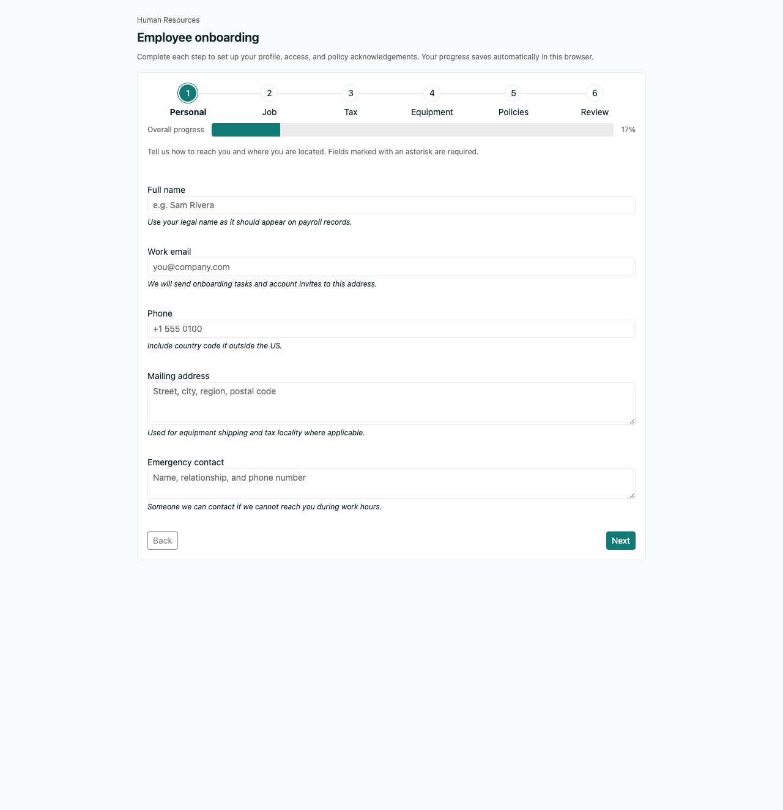

# Employee Onboarding Form

A multi-step **Employee Onboarding Form** for HR or internal operations, built with [Angular](https://angular.dev) and [Kendo UI for Angular](https://www.telerik.com/kendo-angular-ui). The flow includes validation, step navigation, local draft persistence, and a success screen after submit (demo only — no backend).

## Screenshots

The UI was implemented using guidance from the **[Kendo UI Generator MCP server](https://www.telerik.com/kendo-angular-ui/components/ai-assistant/mcp-server)** (Kendo UI for Angular’s MCP tools in Cursor, including the Agentic UI Generator orchestration). The images below were saved from a working local `ng serve` session.

### Initial Prompt
```
#kendo_ui_generator Build a modern web app called “Employee Onboarding Form”.

Goal:
Create a multi-step employee onboarding form for HR or internal operations. The experience should feel clean, guided, and easy to complete.

Requirements:
- Build a multi-step form flow with progress indicator
- Steps should include:
  1. Personal Information
  2. Job Details
  3. Tax / Payroll Information
  4. Equipment / Access Requests
  5. Policies / Agreements
  6. Review & Submit
- Personal Information step:
  - full name
  - email
  - phone
  - address
  - emergency contact
- Job Details step:
  - department
  - job title
  - manager
  - start date
  - employment type
  - location/work mode
- Tax / Payroll step:
  - placeholder fields for tax ID, bank details, payment preferences
  - include clear note that this is mock/demo data
- Equipment / Access Requests step:
  - laptop choice
  - accessories
  - software access
  - systems/accounts needed
- Policies / Agreements step:
  - checklist/checkbox acknowledgements
  - handbook confirmation
  - security policy agreement
  - code of conduct acknowledgement
- Review & Submit step:
  - summary of all entered information
  - edit previous sections option
  - final submit action
- Include:
  - field validation
  - step-by-step navigation
  - save progress locally
  - success confirmation screen after submit
  - clean error messaging
- Make the layout responsive and user-friendly
- Use reusable form components where possible
- Include accessible labels and helpful instructions

Implementation notes:
- No backend required
- Use local state and/or local storage to preserve progress
- Keep the form realistic but safe, with mock/demo handling for sensitive fields
- Organize code clearly by steps/components
- Include a README with setup instructions and notes on where to integrate real APIs or submission handling later

Please scaffold the full multi-step app and briefly explain the structure when done.
```



*Main wizard on the **Personal** step: Kendo Stepper, overall progress bar, and form fields. If this does not render in your Markdown preview, open [docs/screenshots/onboarding-wizard-personal-step.png](./docs/screenshots/onboarding-wizard-personal-step.png) directly.*

*Troubleshooting reference: dev server before `@angular/localize/init` was added as a polyfill in `angular.json` — runtime error `$localize is not defined` can produce an empty page. Confirm the localize polyfill is present and restart `ng serve`.*

## Origin and chat history

The conversational prompt and implementation notes that drove this project are preserved in **cursor_employee_onboarding_form_structu.md](./cursor_employee_onboarding_form_structu.md)** (exported Cursor chat history). That thread used the **Kendo UI Generator MCP server** for Angular — the orchestrator that plans Kendo components, layout utilities, styling, and accessibility checks when building or refining UIs (see the MCP documentation below).

Official references:

- **[Kendo UI Generator MCP server](https://www.telerik.com/kendo-angular-ui/components/ai-assistant/mcp-server)** — install and use the Kendo UI for Angular MCP in Cursor (includes the UI Generator workflow).
- [Agentic UI Generator (overview)](https://www.telerik.com/kendo-angular-ui/components/ai-tools/agentic-ui-generator) — how the UI Generator fits the AI-assisted workflow.

## Prerequisites

- Node.js (LTS recommended)
- npm (project uses npm 11+)

## Setup

```bash
npm install
```

## Run locally

```bash
npm start
```

Open `http://localhost:4200/`. The default route loads the onboarding wizard.

## Build

```bash
npm run build
```

Output is written to `dist/employee-onboarding-form`.

## Tests

```bash
npm test
```

This project uses the Angular CLI’s **Vitest** integration. If the CLI reports missing browser packages for your environment, install the suggested `@vitest/browser-*` package from the error message, or run tests in the IDE using the configured test target.

## Kendo UI license

Kendo UI is a commercial product. For development, follow [Kendo UI licensing](https://www.telerik.com/kendo-angular-ui/my-license/): install a license key or use trial terms as documented by Progress. You can call `setLicenseKey` from `@progress/kendo-licensing` in `main.ts` when you have a key.

## Integrating real APIs later

| Area | Where to integrate |
|------|-------------------|
| **Submit handler** | `OnboardingWizardComponent.submit()` in `src/app/onboarding/onboarding-wizard.component.ts` — replace the demo `storage.clear()` + `submitted.set(true)` with an HTTP call (e.g. `HttpClient.post`) to your HRIS or workflow API. |
| **Sensitive payroll data** | `TaxPayrollStepComponent` uses placeholder fields on purpose. In production, collect tax and banking details through your payroll provider’s secure flow or tokenized fields, not plain text in a generic form. |
| **Auth** | Add `HttpClient` interceptors (or `provideHttpClient(withInterceptors(...))`) for tokens and correlate submissions with the signed-in user. |
| **Draft sync** | `OnboardingStorageService` (`src/app/onboarding/onboarding-storage.service.ts`) persists to `localStorage`. Swap or extend this with server-backed drafts (user id + version) if users switch devices. |

Storage key: `employee-onboarding-form-draft-v1` (see `ONBOARDING_STORAGE_KEY`).

## Project structure (high level)

- `src/app/onboarding/onboarding-wizard.component.*` — shell: stepper, progress bar, navigation, submit, success screen, autosave.
- `src/app/onboarding/steps/` — one component per step (personal, job, tax, equipment, policies, review).
- `src/app/onboarding/onboarding-storage.service.ts` — load/save/clear draft JSON.
- `src/app/onboarding/onboarding-options.ts` — shared dropdown/multiselect option lists.
- `src/styles.css` — Kendo Default theme, theme utils, and app-level CSS variables.

## Security note

This app is intentionally **frontend-only**. Do not paste real tax IDs, bank account numbers, or other regulated data unless the app is wired to secure, approved endpoints and meets your organization’s compliance requirements.
